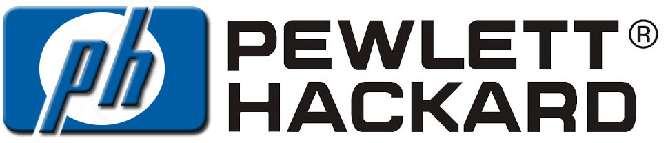
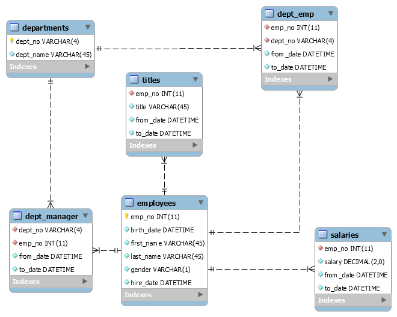

# Unit 7 Homework: 
# Employee Database: A Mystery in Two Parts

## Background

It is a beautiful spring day, and it is two weeks since you have been hired as a new data engineer at Pewlett Hackard. Your first major task is a research project on employees of the corporation from the 1980s and 1990s. All that remain of the database of employees from that period are six CSV files.

In this assignment, you will design the tables to hold data in the CSVs, import the CSVs into a SQL database, and answer questions about the data. In other words, you will perform:

1. Data Modeling
2. Data Engineering
3. Data Analysis

# 1. Data Modeling

Lorem ipsum dolor sit amet, vis quis option adversarium et. Dicam repudiare ius ei, vim ut eros laudem perfecto. Ad vix nemore utamur inciderint, sea no legimus ancillae. Et eirmod consequuntur nam, cu pri mutat consequuntur. Feugait percipit eu mei.

Eos zril delenit atomorum eu, vim eu modo incorrupte. Ea justo animal accusamus vim. Graece meliore eos ut, per mazim liber cu, ea case wisi soluta pri. Eam no vidit atqui mentitum, essent accumsan mel ad. Vis ne tota nonumy torquatos, ne sit oratio officiis tractatos.

# 2. Data Engineering

Lorem ipsum dolor sit amet, vis quis option adversarium et. Dicam repudiare ius ei, vim ut eros laudem perfecto. Ad vix nemore utamur inciderint, sea no legimus ancillae. Et eirmod consequuntur nam, cu pri mutat consequuntur. Feugait percipit eu mei.

Eos zril delenit atomorum eu, vim eu modo incorrupte. Ea justo animal accusamus vim. Graece meliore eos ut, per mazim liber cu, ea case wisi soluta pri. Eam no vidit atqui mentitum, essent accumsan mel ad. Vis ne tota nonumy torquatos, ne sit oratio officiis tractatos.

# 3. Data Analysis

Lorem ipsum dolor sit amet, vis quis option adversarium et. Dicam repudiare ius ei, vim ut eros laudem perfecto. Ad vix nemore utamur inciderint, sea no legimus ancillae. Et eirmod consequuntur nam, cu pri mutat consequuntur. Feugait percipit eu mei.

Eos zril delenit atomorum eu, vim eu modo incorrupte. Ea justo animal accusamus vim. Graece meliore eos ut, per mazim liber cu, ea case wisi soluta pri. Eam no vidit atqui mentitum, essent accumsan mel ad. Vis ne tota nonumy torquatos, ne sit oratio officiis tractatos.

## Summary

Lorem ipsum dolor sit amet, vis quis option adversarium et. Dicam repudiare ius ei, vim ut eros laudem perfecto. Ad vix nemore utamur inciderint, sea no legimus ancillae. Et eirmod consequuntur nam, cu pri mutat consequuntur. Feugait percipit eu mei.

Eos zril delenit atomorum eu, vim eu modo incorrupte. Ea justo animal accusamus vim. Graece meliore eos ut, per mazim liber cu, ea case wisi soluta pri. Eam no vidit atqui mentitum, essent accumsan mel ad. Vis ne tota nonumy torquatos, ne sit oratio officiis tractatos.

Ut mucius ceteros atomorum vim, reque nostrud dolores ex qui, eu qui quodsi feugait voluptaria. Usu volumus periculis ad, quo possit phaedrum conceptam ex, mea saperet facilisi conceptam te. Aeque dictas persius usu cu. Summo postea percipit in vel.

Ex his aliquip tamquam, nam te posse ullum nonumes, diceret recusabo consequuntur vis no. At mea brute dolor. Has no verear expetenda, eu vidit euismod facilisi sed, purto noster sit ne. Vim sumo ancillae et, an omittam vivendum nam. Per ne accusam pericula. Graeci habemus electram qui ut, semper epicurei referrentur ius ut, in porro etiam elaboraret has.

Ad eum quot error soleat, in sea solum possim, eos quodsi dissentias id. Vix exerci euismod civibus id, eam clita delenit maiestatis ut. Natum invidunt aliquando at nam, sed ex viderer volutpat. Fabellas eloquentiam philosophia cum id, cu ceteros argumentum consequuntur mei, magna munere temporibus no has. Per et quot brute definiebas, pri ad melius atomorum, his in iudico singulis sententiae. Tritani nostrud liberavisse has ex, electram percipitur mel te, no natum alienum necessitatibus quo.

## Submission

https://github.com/BrianLabelle/pewletthackard

- - -

© 2019 Rice Cookers | Brian Labelle | Sous-Coding Chef
